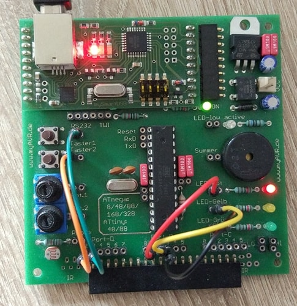

# Control LED with Atmel Microcontroller

### Accessories
- myAVR MK2 board
- hookup wires

### Pin Configuration
- PB1  red LED 
- PB2  yellow LED 
- PB3  green LED 
- PD2  Taster1 
- PD3  Taster2

### Output
- When any or both pushbuttons (or taster) are pressed, yellow LED will be ON. Otherwise yellow LED is OFF. 
- When only one pushbutton is pressed, green LED will be ON. Otherwise green LED is OFF. 
- When both pushbuttons are pressed, red LED will be OFF. Otherwise red LED is ON.
