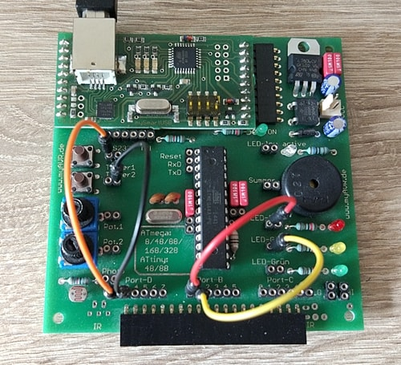

# Control LED with External Interrupt

### Accessories
- myAVR MK2 board
- hookup wires

### Description
Blink Yellow LED every 0.5 sec, enable and disable Red LED with two pushbuttons using interrupt 
(here PD2 and PD3 are used for External Interrupt).

### Pin Configuration
- PD2 to Taster1 
- PD3 to Taster2 
- PB0 to Red LED 
- PB1 to Yellow LED

