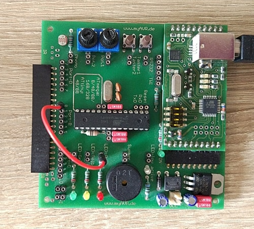

Toggle LED at 1Hz (50% duty cycle)
==================================

Accessories
-----------
- myAVR MK2 board
- hookup wires

Pin Configuration
-----------------
Connect PB0 to Red LED

Calculation
-----------
Here, f= 1Hz and duty cycle = 50%

So, T= T(ON) + T(OFF) = 1 sec

Hence toggle LED every 0.5 sec (0.5 sec ON + 0.5 sec OFF)

Prescaler
---------
`TCCR1B |= (1 << CS11)|(1 << CS10); //prescaler 64 for 8MHz microcontroller`
